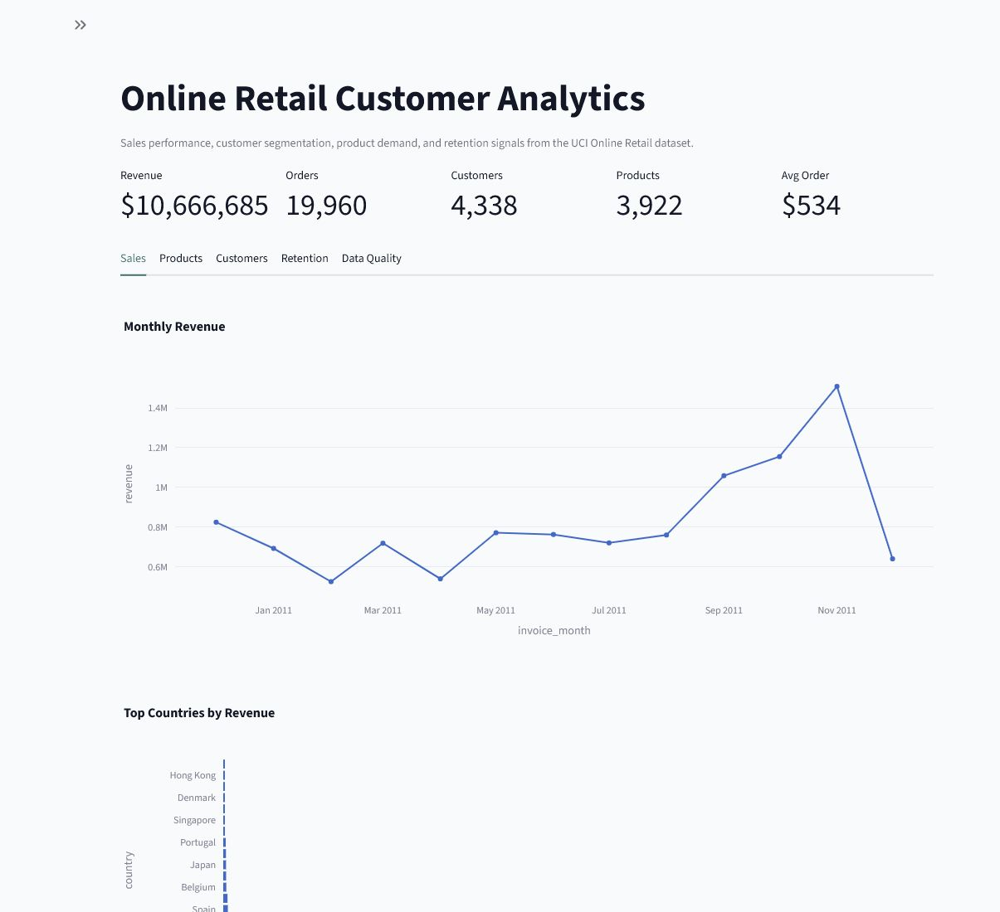

# Online Retail Customer Analytics Dashboard

Portfolio data analysis project using the Kaggle Online Retail Transactions dataset, originally sourced from the UCI Machine Learning Repository.

This project demonstrates a complete analyst workflow: data validation, cleaning, feature engineering, business KPI analysis, RFM customer segmentation, retention-style cohort summaries, and an interactive Streamlit dashboard.

## Project Story

An online retailer wants to understand revenue performance, product demand, customer quality, and repeat-purchase behavior. The raw transaction data includes cancelled invoices, missing customer IDs, invalid quantities, and country/product variation, which makes it a useful portfolio dataset for practical cleaning and dashboard design.

## Dashboard Preview



Live Streamlit Cloud link: pending deployment.

## Dataset

Download the CSV from Kaggle and save it here:

```text
data/raw/online_retail.csv
```

Kaggle dataset: <https://www.kaggle.com/datasets/fareselgohary003/online-retail-transactions-uci/data>

Original source: UCI Machine Learning Repository, Online Retail dataset.

The raw CSV is ignored by Git so the repository stays lightweight and license-conscious.

## Repository Structure

```text
.
├── app.py
├── src/
│   ├── data_cleaning.py
│   ├── features.py
│   ├── pipeline.py
│   └── config.py
├── scripts/
│   └── eda_summary.py
├── tests/
│   └── test_pipeline.py
├── data/
│   ├── raw/
│   └── processed/
└── AGENT.md
```

## Setup

Create and activate a virtual environment, then install dependencies:

```powershell
py -m venv .venv
.\.venv\Scripts\Activate.ps1
pip install -r requirements.txt
```

If `py` is unavailable, use the bundled Codex Python executable or install Python 3.11+.

## Run the Pipeline

```powershell
python -m src.pipeline
```

This creates cleaned and aggregated dashboard tables in `data/processed/`.

## Run the Dashboard

```powershell
streamlit run app.py
```

The dashboard includes:

- KPI cards for revenue, orders, customers, products, and average order value
- Monthly revenue trend
- Country and product performance
- RFM customer segmentation
- Retention cohort table and heatmap
- Data quality summary

## Run Tests

```powershell
python -m unittest discover -s tests
```

## GitHub Deployment Notes

1. Create an empty GitHub repository named `online-retail-customer-analytics-dashboard`.
2. Add the remote locally:

```powershell
git remote add origin https://github.com/<your-username>/online-retail-customer-analytics-dashboard.git
git branch -M main
git push -u origin main
```

3. For Streamlit Cloud, connect the GitHub repo and set `app.py` as the entrypoint.

If public deployment cannot include the raw dataset, run the pipeline locally and decide whether to commit only aggregated, anonymized outputs based on the dataset license terms.
